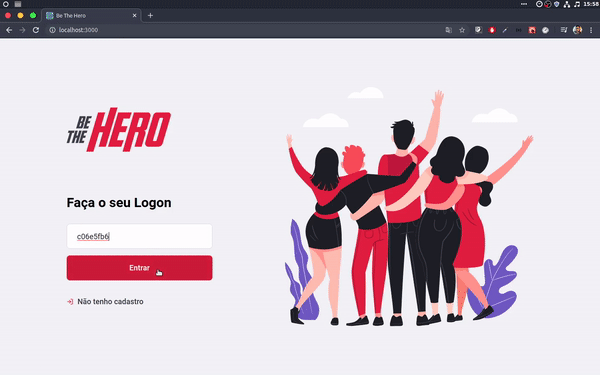
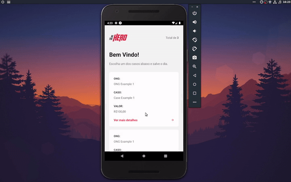

<h1 align="center">
    
</h1>

  

<h2 align="center"> Plataforma para conectar ONGs e seus casos á pessoas que tem disponibilidade para ajudar </h2>

<h3 align="center"> Stacks utilizadas  React,  React Native,  Node e  SQLite </h3>

## Available Scripts

## The server and database was done with NodeJS, ExpressJS, KnexJS and SQLite.

In the project directory backend, you can run:

### `yarn dev`

Runs the server in the development mode. 

You will also see any lint errors in the console.

## The mobile app was done with React Native and EXPO

In the project directory mobile, you can run:

### `yarn start` || `npm start` || `expo start`

Runs the app in the development mode. 

The app will reload if you make edits. 
You will also see any lint errors in the console.

## The web app was done with ReactJS

In the project directory frontend, you can run:

### `yarn start`

Runs the app in the development mode. 
Open [http://localhost:3000](http://localhost:3000) to view it in the browser.

The page will reload if you make edits. 
You will also see any lint errors in the console.
